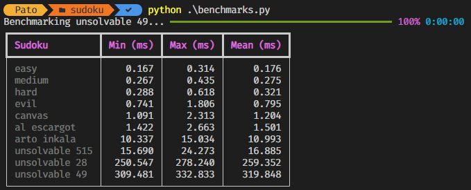
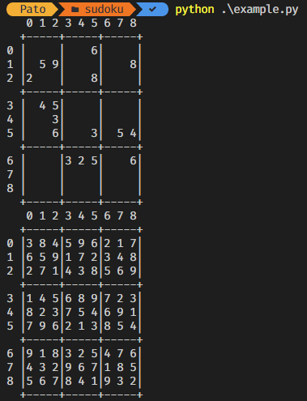

# Python Solver

This project consists of a sudoku solver written in python. It uses a depth-first search technique iterating over all the possibilities and attempting them. It's also been optimized to be fast. It flattens the board to an array instead of a matrix and uses lists, sets, and arrays for caching and faster calculations.

## Sudokus

* Easy (Generated from [WebSudoku](https://www.websudoku.com))
* Medium (Generated from [WebSudoku](https://www.websudoku.com))
* Hard (Generated from [WebSudoku](https://www.websudoku.com))
* Evil (Generated from [WebSudoku](https://www.websudoku.com))
* [Arto Inkala "World hardest"](https://www.sudokuwiki.org/Print_Arto_Inkala_Sudoku)
* Canvas (example provided by the teacher in cavas)
* [Al escargot](https://www.kristanix.com/sudokuepic/worlds-hardest-sudoku.php)
* [Unsolvable 515](https://www.sudokuwiki.org/Weekly_Sudoku.asp?puz=515)
* [Unsolvable 28](https://www.sudokuwiki.org/Weekly_Sudoku.asp?puz=28)
* [Unsolvable 49](https://www.sudokuwiki.org/Weekly_Sudoku.asp?puz=49)

Unsolvable 515 was this week's sudoku (9/22/2022). The other unsolvable were found from this [blog post](https://www.sudokuwiki.org/Arto_Inkala_Sudoku) claiming that they were even harder than the Arto Inkala sudoku, which our algorithm struggles a little to solve.

### Benchmarks

Running the solver 200 times for each board yields the following results:

Interestingly the unsolvable ones take longer than "the world's hardest sudoku".

## Example Solution

